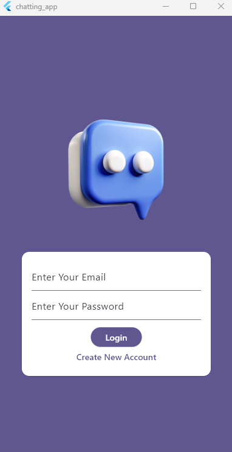
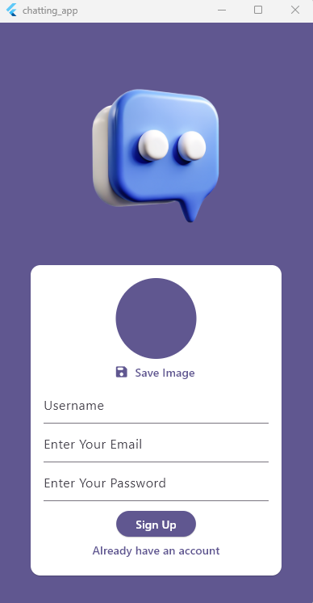
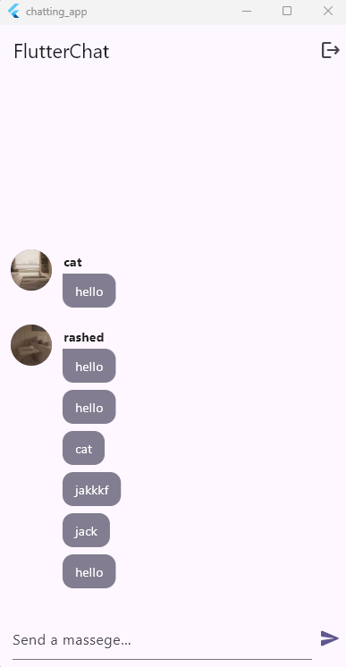

# Flutter Chat App 💬

A high-performance, real-time messaging application built with the Flutter framework and Firebase backend. This project showcases a complete implementation of user authentication, cloud-based data synchronization, and media handling.

---

## 🚀 Overview
The **Flutter Chat App** is designed to provide a seamless communication experience. It demonstrates how to integrate multiple Firebase services to build a production-ready mobile application with a focus on clean UI and efficient state management.

## 📸 Screenshots
<p align="center">
  
  
  
</p>

## ✨ Key Features
* **Secure Authentication:** User signup and login via Firebase Auth (Email/Password).
* **Real-time Synchronization:** Instant message updates across devices using Cloud Firestore.
* **Profile Customization:** Integrated image picker for custom user profile photos stored in Firebase Storage.
* **Push Notifications:** Background alerts for new messages via Firebase Cloud Messaging (FCM).
* **Responsive UI:** Custom-built chat bubbles, loading states, and smooth transitions.

## 🛠 Tech Stack
| Category | Technology |
| :--- | :--- |
| **Framework** | [Flutter](https://flutter.dev/) (Dart) |
| **Database** | [Cloud Firestore](https://firebase.google.com/docs/firestore) |
| **Authentication** | [Firebase Auth](https://firebase.google.com/docs/auth) |
| **Storage** | [Firebase Storage](https://firebase.google.com/docs/storage) |
| **Notifications** | [Firebase Cloud Messaging](https://firebase.google.com/docs/cloud-messaging) |

---

## ⚙️ Getting Started

### Prerequisites
* Flutter SDK (3.x or higher)
* Android Studio / VS Code
* A Firebase Project

### Installation
**Clone the repository:**
   ```bash
   git clone [https://github.com/RashedKhanSezan/flutter_projects.git](https://github.com/RashedKhanSezan/flutter_projects.git)
   cd chatting_app
